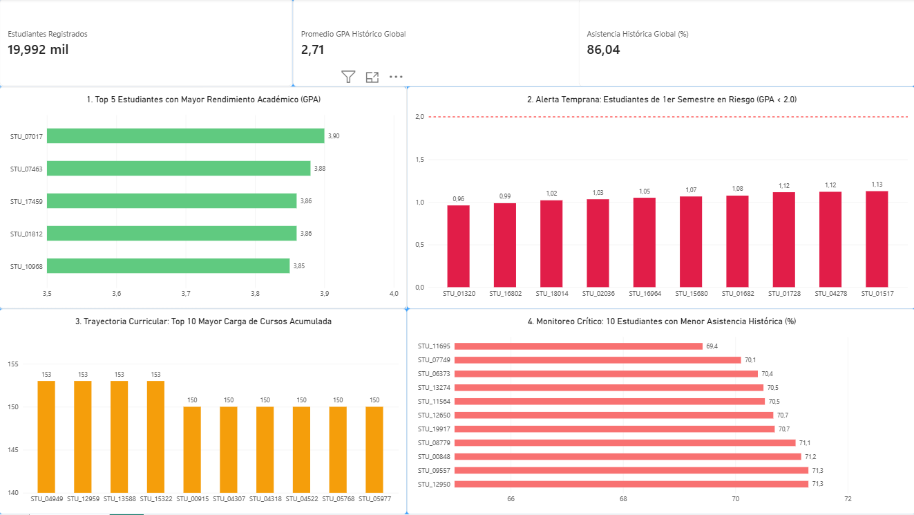

# Laboratorio 3 - Big Data

Proyecto para realizar un flujo de ingestión, limpieza, transformación y análisis de datos académicos con Python y PySpark.

## Descripción del proyecto

El objetivo es procesar un dataset de rendimiento académico y retención estudiantil para:

- ingestar los datos crudos,
- limpiar registros inconsistentes,
- transformar la información a una capa Gold,
- consultar indicadores útiles para análisis institucional.

## Fuente del dataset

https://www.kaggle.com/datasets/razanihababdellatif/student-retention-and-academic-performance-data

El archivo base del proyecto se encuentra en:

- `dataset/academic_survival_longitudinal.csv`

## Estructura del repositorio

```text
.
├── data/
│   ├── gold/
│   │   └── resumen_estudiantes/
│   ├── processed/
│   │   ├── reporte_calidad.txt
│   │   └── students_limpios.csv
│   └── raw/
│       └── students_raw.csv
├── dataset/
│   └── academic_survival_longitudinal.csv
├── scripts/
│   ├── consultas.py
│   ├── ingesta.py
│   ├── limpieza.py
│   ├── transformacion.ipynb
│   └── trasformacion.py
├── README.md
├── requirements.txt
└── .gitignore
```

## Requisitos previos

- Python 3.x
- Java 17
- Hadoop local configurado con `winutils` y la variable de entorno `HADOOP_HOME` en Windows

## Preparación del entorno

Desde la raíz del proyecto, crea y activa un entorno virtual:

```bash
python -m venv venv
.\venv\Scripts\activate
```

Instala las dependencias:

```bash
pip install -r requirements.txt
```

## Ejecución del pipeline

### 1. Ingesta de datos

```bash
python scripts\ingesta.py
```

Esto crea el archivo en:

- `data/raw/students_raw.csv`

### 2. Limpieza de datos

```bash
python scripts\limpieza.py
```

Esto genera:

- `data/processed/students_limpios.csv`
- `data/processed/reporte_calidad.txt`

### 3. Transformación a Gold

Se recomienda ejecutar desde la carpeta `scripts` porque el script usa rutas relativas a esa ubicación:

```bash
cd scripts
python trasformacion.py
```

Esto crea la salida en:

- `data/gold/resumen_estudiantes/`

### 4. Consultas analíticas

```bash
cd scripts
python consultas.py
```

Este script ejecuta consultas SQL sobre la capa Gold para mostrar:

- mejores promedios,
- alumnos con menor asistencia,
- estudiantes en riesgo académico,
- mayor carga académica.

## Visualización y Dashboard (Power BI)

Se implementó un dashboard interactivo en Power BI Desktop conectado directamente a la capa Gold (`data/gold/resumen_estudiantes/`) leyendo el archivo nativo Parquet.

### Vista del Dashboard



### Métricas y Consultas Representadas

- **KPIs Globales:** Total de estudiantes (19.992), promedio GPA histórico (2,71) y asistencia media universitaria (86,04%).
- **Top 5 GPA:** Alumnos con mejor rendimiento histórico, liderado por `STU_07017` (GPA 3.90).
- **Alerta Riesgo Semestre 1:** Monitoreo de los 10 casos más críticos de primer semestre con GPA inferior a 2.0 (umbral de reprobación).
- **Carga Académica:** Top 10 estudiantes con mayor cantidad de cursos acumulados (máximo de 153 asignaturas).
- **Monitoreo de Asistencia:** Detección de los 10 alumnos con menor porcentaje de asistencia histórica (rango crítico de 69,4% a 71,3%).

El archivo `.pbix` con las visualizaciones y filtros se encuentra disponible en `dashboard/dashboard_estudiantes.pbix`.

## Resultados esperados

Al finalizar el flujo, el proyecto genera una capa de datos preparada para análisis con una estructura resumida por estudiante en formato Parquet.

## Notas

- El notebook `scripts/transformacion.ipynb` puede usarse para revisar la transformación paso a paso.

- En Windows, es importante tener configurado correctamente Java y Hadoop para que PySpark pueda ejecutarse sin errores.
